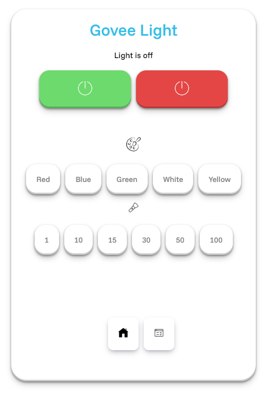

# Govee Lamp Web App

This project is a web application designed to control the Govee Lamp H6052. Users can turn the lamp on and off and control other settings through a simple web interface.




## Run Locally

Clone the project

```bash
  git clone https://github.com/RayHyper/Govee-Web-App.git
```

Go to the project directory

```bash
  cd Govee-Web-App
```

Install dependencies

```bash
  npm install
```

Start the local server

```bash
  npm run dev
```

## API Reference

### Get Devices

Get devices from Govee

```http
GET /router/api/v1/user/devices
Host: https://openapi.api.govee.com
Govee-API-Key: xxxx
```

### Control Device

Turn devices on/off and control other settings.

```http
POST /router/api/v1/device/control
Host: https://openapi.api.govee.com
Govee-API-Key: xxxx

{
  "requestId": "uuid",
  "payload": {
    "sku": "H605C",                  
    "device": "64:09:C5:32:37:36:2D:13",
    "capability": {
      "type": "devices.capabilities.on_off",
      "instance": "powerSwitch",
      "value": 0                      
    }
  }
}
```

## Authentication
Include your API key in all requests:
```http
Govee-API-Key: xxxx
```


## Recommended IDE Setup

[VSCode](https://code.visualstudio.com/) + [Volar](https://marketplace.visualstudio.com/items?itemName=Vue.volar) (and disable Vetur).

## Customize configuration

See [Vite Configuration Reference](https://vite.dev/config/).

## Project Setup

```sh
npm install
```

### Compile and Hot-Reload for Development

```sh
npm run dev
```

### Compile and Minify for Production

```sh
npm run build
```

## Tech Stack

**Client:** Vue.js, Vite

**Server:** Node.js, Express, Axios


## Other
Not affiliated with Govee or other products made for educational purposes only 😊.
